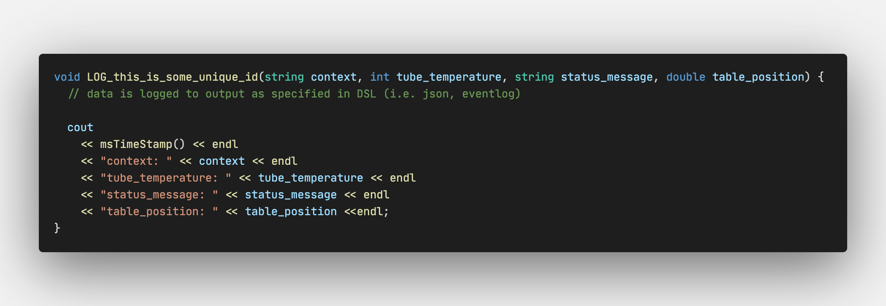

# Log Statement Generator

Logging is increasingly used by up-stream analytics tooling, so it should be considered as an external interface of a system. As with other interfaces, it is important to clearly define this logging-interface.

A DSL (domain specific language) can be used to specify such a logging interface, including the definition of id's, meta-data, (typed) values, etc.

Such a DSL could look like this:


The DSL can then be used to generate the actual log-statements in the required target languages;
for example C++:



The log-statements can be used anywhere in the codebase with proper compile-time checking on data and type.


For ease of implementation, we use JSON instead of a full-blown DSL to define the logging-interface.

A Python script reads the JSON file and generates the actual log-statements in the target language (C++ in this case).

```zsh
./generate-cpp.py log-interface.json log-lib/log-lib.cpp log-lib/log-lib.h
```
